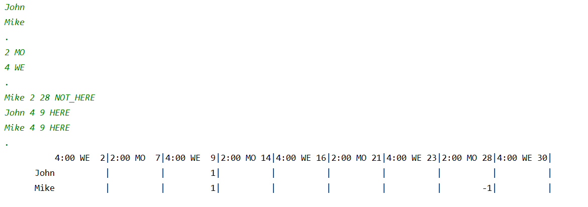

Структуры и массивы управления

В этом дне мы изучали основы решения как тривиальных, так и более сложных бизнес-задач с использованием базовых конструкций языка Java

# Содержание

1. [Правила дня](https://github.com/Aramil326/Java_bootcamp/tree/master/Java_Bootcamp._Day1#%D0%BF%D1%80%D0%B0%D0%B2%D0%B8%D0%BB%D0%B0-%D0%B4%D0%BD%D1%8F)
2. [Exercise 00 – Сумма цифр](https://github.com/Aramil326/Java_bootcamp/tree/master/Java_Bootcamp._Day1#exercise-00--%D1%81%D1%83%D0%BC%D0%BC%D0%B0-%D1%86%D0%B8%D1%84%D1%80-%D0%B4%D0%B8%D1%80%D0%B5%D0%BA%D1%82%D0%BE%D1%80%D0%B8%D1%8F-%D0%B7%D0%B0%D0%B4%D0%B0%D0%BD%D0%B8%D1%8F)
3. [Exercise 01 – Действительно простое число](https://github.com/Aramil326/Java_bootcamp/tree/master/Java_Bootcamp._Day1#exercise-01--%D0%B4%D0%B5%D0%B9%D1%81%D1%82%D0%B2%D0%B8%D1%82%D0%B5%D0%BB%D1%8C%D0%BD%D0%BE-%D0%BF%D1%80%D0%BE%D1%81%D1%82%D0%BE%D0%B5-%D1%87%D0%B8%D1%81%D0%BB%D0%BE-%D0%B4%D0%B8%D1%80%D0%B5%D0%BA%D1%82%D0%BE%D1%80%D0%B8%D1%8F-%D0%B7%D0%B0%D0%B4%D0%B0%D0%BD%D0%B8%D1%8F)
4. [Exercise 02 – Бесконечная последовательность (или нет?)](https://github.com/Aramil326/Java_bootcamp/tree/master/Java_Bootcamp._Day1#exercise-02--%D0%B1%D0%B5%D1%81%D0%BA%D0%BE%D0%BD%D0%B5%D1%87%D0%BD%D0%B0%D1%8F-%D0%BF%D0%BE%D1%81%D0%BB%D0%B5%D0%B4%D0%BE%D0%B2%D0%B0%D1%82%D0%B5%D0%BB%D1%8C%D0%BD%D0%BE%D1%81%D1%82%D1%8C-%D0%B8%D0%BB%D0%B8-%D0%BD%D0%B5%D1%82-%D0%B4%D0%B8%D1%80%D0%B5%D0%BA%D1%82%D0%BE%D1%80%D0%B8%D1%8F-%D0%B7%D0%B0%D0%B4%D0%B0%D0%BD%D0%B8%D1%8F)
5. [Exercise 03 – Немного статистики](https://github.com/Aramil326/Java_bootcamp/tree/master/Java_Bootcamp._Day1#exercise-03--%D0%BD%D0%B5%D0%BC%D0%BD%D0%BE%D0%B3%D0%BE-%D1%81%D1%82%D0%B0%D1%82%D0%B8%D1%81%D1%82%D0%B8%D0%BA%D0%B8-%D0%B4%D0%B8%D1%80%D0%B5%D0%BA%D1%82%D0%BE%D1%80%D0%B8%D1%8F-%D0%B7%D0%B0%D0%B4%D0%B0%D0%BD%D0%B8%D1%8F)
6. [Exercise 04 – Еще немного статистики](https://github.com/Aramil326/Java_bootcamp/tree/master/Java_Bootcamp._Day1#exercise-04--%D0%B5%D1%89%D0%B5-%D0%BD%D0%B5%D0%BC%D0%BD%D0%BE%D0%B3%D0%BE-%D1%81%D1%82%D0%B0%D1%82%D0%B8%D1%81%D1%82%D0%B8%D0%BA%D0%B8-%D0%B4%D0%B8%D1%80%D0%B5%D0%BA%D1%82%D0%BE%D1%80%D0%B8%D1%8F-%D0%B7%D0%B0%D0%B4%D0%B0%D0%BD%D0%B8%D1%8F)
7. [Exercise 05 – Расписание](https://github.com/Aramil326/Java_bootcamp/tree/master/Java_Bootcamp._Day1#exercise-05--%D1%80%D0%B0%D1%81%D0%BF%D0%B8%D1%81%D0%B0%D0%BD%D0%B8%D0%B5-%D0%B4%D0%B8%D1%80%D0%B5%D0%BA%D1%82%D0%BE%D1%80%D0%B8%D1%8F-%D0%B7%D0%B0%D0%B4%D0%B0%D0%BD%D0%B8%D1%8F)


##  Правила дня
- Пользовательские методы и классы запрещены для всех задач дня, за исключением пользовательских статических функций и процедур в основном файле классов решения.
- Все задачи содержат список РАЗРЕШЕННЫХ языковых конструкций для конкретной задачи.
- System::exit можно использовать для всех задач.
- Все задачи содержат пример работы приложения. Реализованное решение должно быть идентично указанному примеру вывода для текущих входных данных.
- В целях иллюстрации данные, вводимые пользователем в примерах задач, предваряются стрелкой (->). Не учитывайте эти стрелки при реализации решения!

P.S. Некоторые задачи требуют нетривиального подхода из-за упомянутых выше ограничений. Эти ограничения научат вас находить решения для автоматизации реальных бизнес-процессов.


## Exercise 00 – Сумма цифр ([директория задания](src/ex00)) 

| Exercise 00: Sum of Digits |                                         |
|----------------------------|-----------------------------------------|
| Директория сдачи задания   | ex00                                    |
| Файл сдачи задания         | 	Program.java                           |
| **Допустимые конструкции** |                                         |
| Input/Output               | System.out                              |
| Types                      | 	Primitive types                        |
| Operators                  | 	Standard operations of primitive types |

#### Задание
Вычислить сумму цифр шестизначного целого числа (значение числа задается непосредственно в коде путем явной инициализации переменной числа).

Пример работы программы для числа 479598:
```
$ java Program
  42
```

## Exercise 01 – Действительно простое число ([директория задания](src/ex01))

| Exercise 01: Действительно простое число |                                                            |
|------------------------------------------|------------------------------------------------------------|
| Директория сдачи задания                 | 	ex01                                                      |
| Файл сдачи задания                       | 	Program.java                                              |
| **Допустимые конструкции**               |                                                            |
| Input/Output	                            | System.out, System.err, Scanner(System.in)                 |
| Types                                    | 	Primitive types                                           |
| Operators                                | 	Standard operations of primitive types, conditions, loops |

Согласно теореме Бема-Якопини, любой алгоритм можно написать с использованием трех утверждений: последовательности, выбора и итерации.

Используя эти инструкции в Java, вам необходимо определить, является ли входное число простым. Простое число — это число, у которого нет других делителей, кроме самого числа и 1.

Программа принимает в качестве входных данных число, введенное с клавиатуры, и отображает результат проверки того, является ли это число простым. Кроме того, программа выводит количество шагов (итераций), необходимых для выполнения проверки. В этой задаче итерация — это одна операция сравнения.

Для отрицательных чисел 0 и 1 отобразите сообщение «Недопустимый аргумент» и закройте программу с помощью кода -1.

Пример работы программы:

```
$ java Program
-> 169
   false 12

$ java Program
-> 113
   true 10

$ java Program
-> 42
   false 1

$ java Program
-> -100 
   Illegal Argument
```

## Exercise 02 – Бесконечная последовательность (или нет?) ([директория задания](src/ex02))

| Бесконечная последовательность (или нет?) |                                                            |
|-------------------------------------------|------------------------------------------------------------|
| Директория сдачи задания                  | 	ex02                                                      |
| Файл сдачи задания                        | 	Program.java                                              |
| **Допустимые конструкции**                |                                                            |
| Input/Output                              | 	System.out, System.err, Scanner(System.in)                |
| Types                                     | 	Primitive types                                           |
| Operators                                 | 	Standard operations of primitive types, conditions, loops |

Сегодня вы Google. Вам необходимо посчитать запросы, связанные с приготовлением кофе, которые делают пользователи нашей поисковой системы в определенный момент. Понятно, что последовательность поисковых запросов бесконечна. Невозможно хранить эти запросы и подсчитывать их позже.

Но выход есть — обрабатывать поток запросов. Зачем нам тратить ресурсы на все запросы, если нас интересует только конкретная особенность этой последовательности запросов? Предположим, что каждый запрос представляет собой любое натуральное число, кроме 0 и 1. Запрос относится к приготовлению кофе только в том случае, если сумма цифр числа (запроса) является простым числом.

Итак, нам нужно реализовать программу, которая будет подсчитывать количество элементов для заданного набора чисел, сумма цифр которого является простым числом. Для простоты предположим, что эта потенциально бесконечная последовательность запросов все еще ограничена, а последний элемент последовательности имеет номер 42.

Эта задача гарантирует, что входные данные абсолютно верны.
Пример работы программы:


```
$ java Program
-> 198131
-> 12901212
-> 11122
-> 42
   Count of coffee-request – 2
```

## Exercise 03 – Немного статистики ([директория задания](src/ex03))
| Exercise 03: Немного статистики |                                                           |
|---------------------------------|-----------------------------------------------------------|
| Директория сдачи задания        | 	ex03                                                     |
| Файл сдачи задания              | 	Program.java                                             |
| **Допустимые конструкции**      |                                                           |
| Input/Output                    | System.out, System.err, Scanner(System.in)                |
| Types                           | 	Primitive types, String                                  |
| Operators	                      | Standard operations of primitive types, conditions, loops |
| Methods                         | 	String::equals                                           |

При разработке корпоративных систем часто возникает необходимость сбора разного рода статистики. А заказчик всегда хочет, чтобы такая аналитика была наглядной. Кому нужны холодные, сухие фигурки?

К такому типу клиентов часто относятся образовательные организации и онлайн-школы. Теперь вам необходимо реализовать функциональные возможности для визуализации прогресса учащихся. Клиент хочет увидеть диаграмму, показывающую изменения успеваемости учащегося за несколько недель.

Заказчик оценивает этот прогресс как минимальную оценку за пять тестов в течение каждой недели. Каждый тест может быть оценен от 1 до 9.

Максимальное количество недель для анализа — 18. После того как программа получила информацию за каждую неделю, она выводит на консоль график, показывающий минимальные оценки за конкретную неделю.

И мы продолжаем считать, что 42 — это предел входных данных.

Точное гарантированное количество тестов в неделю — 5.

Однако порядок ввода еженедельных данных не гарантируется, поэтому данные недели 1 можно вводить после данных недели 2. Если порядок ввода данных неправильный, выводится сообщение IllegalArgument и программа закрывается с кодом -1.

Примечание:

Вариантов хранения информации множество, и массивы — лишь один из них. Примените другой метод хранения данных о тестах учащихся без использования массивов.
Конкатенация строк часто приводит к неожиданному поведению программы. Если в цикле для одной переменной выполняется много итераций операции конкатенации, приложение может существенно замедлиться. Вот почему нам не следует использовать конкатенацию строк внутри цикла для генерации результата.

Пример работы программы:

```
$ java Program
-> Week 1
-> 4 5 2 4 2
-> Week 2
-> 7 7 7 7 6
-> Week 3
-> 4 3 4 9 8
-> Week 4
-> 9 9 4 6 7
-> 42
Week 1 ==>
Week 2 ======>
Week 3 ===>
Week 4 ====>
```

## Exercise 04 – Еще немного статистики ([директория задания](src/ex04))
| Exercise 04: Еще немного статистики |                                                           |
|-------------------------------------|-----------------------------------------------------------|
| Директория сдачи задания	           | ex04                                                      |
| Файл сдачи задания                  | 	Program.java                                             |
| **Допустимые конструкции**          |                                                           |
| Input/Output                        | 	System.out, System.err, Scanner(System.in)               |
| Types                               | Primitive types, String, arrays                           |
| Operators	                          | Standard operations of primitive types, conditions, loops |
| Methods	                            | String::equals, String::toCharArray, String::length       |

Знаете ли вы, что с помощью частотного анализа можно расшифровать плохо зашифрованные тексты?

См. https://en.wikipedia.org/wiki/Frequency_anaанализ .

Почувствуйте себя хакером и реализуйте программу для подсчета вхождений символов в текст.

Нам нравится визуальная ясность. Вот почему программа будет отображать результаты в виде гистограммы. На этой диаграмме будут показаны 10 наиболее часто встречающихся символов в порядке убывания.

Если буквы встречаются одинаковое количество раз, их следует отсортировать в лексикографическом порядке.

Каждый символ может встречаться в тексте большое количество раз. По этой причине диаграмма должна быть масштабируемой. Максимальная высота отображаемой диаграммы — 10, минимальная — 0.

Входные данные для программы представляют собой строку с одним символом «\n» в конце (таким образом, в качестве входных данных можно использовать одну длинную строку).

Предполагается, что каждый входной символ может содержаться в переменной char (Unicode BMP; например, код буквы «S» — 0053, максимальное значение кода — 65535).

Максимальное количество вхождений символов — 999.

Примечание: данную проблему необходимо решать без многократных итераций по исходному тексту (сортировки и удаления повторов), поскольку эти методы существенно замедлят работу приложения. Используйте другие методы обработки информации.

Пример работы программы:

```
$ java Program

-> AAAAAAAAAAAAAAAAAAAAAAAAAAAAAAAAASSSSSSSSSSSSSSSSSSSSSSSSDDDDDDDDDDDDDDDDDDDDDDDDDDDDDDDDDWEWWKFKKDKKDSKAKLSLDKSKALLLLLLLLLLRTRTETWTWWWWWWWWWWOOOOOOO42

 36
  #  35
  #   #
  #   #  27
  #   #   #
  #   #   #
  #   #   #
  #   #   #  14  12
  #   #   #   #   #   9
  #   #   #   #   #   #   7   4
  #   #   #   #   #   #   #   #   2   2
  D   A   S   W   L   K   O   T   E   R
```

## Exercise 05 – Расписание ([директория задания](src/ex05))

| Exercise 05: Schedule      |                                                           |
|----------------------------|-----------------------------------------------------------|
| Директория сдачи задания	  | ex05                                                      |
| Файл сдачи задания         | Program.java                                              |
| **Допустимые конструкции** |                                                           |
| Input/Output               | System.out, System.err, Scanner(System.in)                |
| Types                      | 	Primitive types, String, arrays                          |
| Operators	                 | Standard operations of primitive types, conditions, loops |
| Methods                    | 	String::equals, String::toCharArray, String::length      |

Вы только что стали великим хакером, но ваш клиент возвращается к вам с другим заданием. На этот раз им нужно уметь вести расписание занятий в своем учебном заведении. Заказчик открывает школу в сентябре 2020 года. Значит, вам необходимо реализовать MVP-версию проекта только в этом месяце.

Вам необходимо иметь возможность создать список учеников и указать время и дни недели занятий. Занятия могут проводиться в любой день недели с 13:00 до 18:00. В один день можно проводить несколько занятий. Однако общее количество занятий в неделю не может превышать 10.

Максимальное количество студентов в расписании также 10. Максимальная длина имени студента 10 (без пробелов).

Вы также должны предоставить возможность записи посещаемости учащихся. Для этого рядом с именем каждого студента необходимо указать время и дату занятий, а также статус посещаемости (ЗДЕСЬ, НЕ_ЗДЕСЬ). Вам не нужно записывать посещаемость всех занятий за месяц.

Таким образом, жизненный цикл приложения выглядит следующим образом:
1. Создание списка студентов
2. Заполнение расписания — каждое занятие (время, день недели) вводится в отдельной строке.
3. Запись посещаемости
4. Отображение расписания в табличной форме со статусами посещаемости.

Каждый этап работы приложения разделяется знаком "." (период). Гарантируется абсолютная корректность данных, за исключением последовательного порядка занятий при заполнении расписания.

Пример работы программы:


