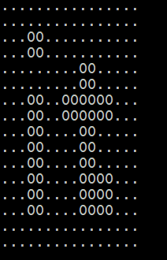

JAR

Сегодня мы научились создавать библиотечные архивы и использовать внешние библиотеки

# Содержание

1. [Exercise 00 – Packages]()
2. [Exercise 01 – First JAR]()
3. [Exercise 02 – JCommander & JCDP]()

## Exercise 00 – Packages ([директория задания](src/ex00))

| Exercise 00: Packages |                                      |
|-----------------------|--------------------------------------|
| Директория сдачи	     | ex00                                 |
| Файлы сдачи	          | ImagesToChar-folder (exclude target) |

Теперь ваша задача — реализовать функционал, выводящий в консоль двухцветное изображение.

Пример черно-белого изображения в формате BMP (данный формат обязателен для решения). Размер изображения 16*16 пикселей.

Ваше приложение должно принимать входные параметры, соответствующие символам, которые должны отображаться вместо белых и черных пикселей. Еще одним основным параметром запуска функции является полный путь к образу на вашем диске.

Если "." символ используется для белого цвета и «0» для черного, изображение в консоли может выглядеть следующим образом:

Логика приложения должна быть распределена между разными пакетами и иметь следующую структуру:

- ImagesToChar - папка проекта
    - src - исходные файлы
        - java - файлы исходного кода Java
          - edu.school21.printer - серия основных пакетов
            - app - пакет, содержащий классы для запуска
            - logic - пакет, содержащий логику преобразования изображения в массив символов
    - target - скомпилированные .class файлы
      - edu.school21.printer ...
    - README.txt

Файл README.txt должен содержать инструкции по компиляции и запуску исходного кода из консоли (не IDE). Инструкция написана для состояния, когда консоль открыта в корневой папке проекта.

## Exercise 01 – First JAR ([директория задания](src/ex01))

| Exercise 01: First JAR |                                      |
|------------------------|--------------------------------------|
| Директория сдачи	      | ex01                                 |
| Файлы сдачи	           | ImagesToChar-folder (exclude target) |

Теперь вам необходимо создать дистрибутив приложения — JAR-архив. Важно, чтобы изображение содержалось в этом архиве (в этой задаче параметр командной строки для указания полного пути к файлу не требуется).

Должна быть соблюдена следующая структура проекта:

- ImagesToChar - папка проекта
    - src - исходные файлы
        - java - файлы исходного кода Java
            - ...
        - resources - папка с файлами ресурсов
            - image.bmp - отображаемое изображение
        - manifest.txt - файл, содержащий описание начальной точки запуска архива.
    - target - скомпилированные файлы .class и архив
        - edu.school21.printer ...
        - resources
        - images-to-chars-printer.jar
    - README.txt

Архив и все скомпилированные файлы при сборке помещаются в целевую папку (без ручного переноса файлов; к папке ресурсов можно применить команду cp).

Файл README.txt также должен содержать информацию о сборке и запуске архива.

## Exercise 02 – JCommander & JCDP ([директория задания](src/ex02))

| Exercise 02: JCommander & JCDP |                                        |
|--------------------------------|----------------------------------------|
| Директория сдачи	              | ex02                                   |
| Файлы сдачи                    | 	ImagesToChar (exclude lib and target) |

Теперь вам следует использовать внешние библиотеки:

- JCommander для командной строки.
- JCDP или JColor для использования цветного вывода

Архивы с этими библиотеками необходимо скачать и включить в проект предыдущей задачи.

Теперь параметры запуска приложения будут обрабатываться средствами JCommander. Изображение должно отображаться с использованием опции «цветного» вывода библиотеки JCDP.

Требуемая структура проекта:

- ImagesToChar - папка проекта
    - lib - папка внешней библиотеки
      - jcommander-*.**.jar
      - JCDP-*.*.*.jar/JCOLOR-*.*.*.jar
    - src - исходные файлы
    - target - скомпилированные файлы .class и архив
      - edu.school21.printer
      - com/beust ... - файлы .class библиотеки JCommander.
      - com/diogonunes ... - файлы .class библиотеки JCDP
      - resources
      - images-to-chars-printer.jar
    - README.txt

Файл README.txt также должен содержать информацию о включении внешних библиотек в финальную сборку.

Пример работы программы:

`$ java -jar images-to-chars-printer.jar --white=RED --black=GREEN`

